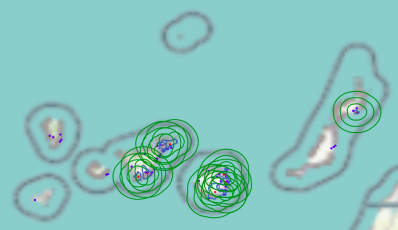

# Grupo de trabajo Longevidad **Col·legi d´Actuaris de Catalunya**

En el repositorio se ha incluido todo los códigos y análisis realizados para el grupo de trabajo de Longevidad del **Col·legi d´Actuaris de Catalunya**:

* **Definición de métricas** para valorar la capacidad de segmetación por edades de un factor

    Siendo la edad el factor más importante para predecir la probabilidad de fallecer, se generan nuevas métricas que miden la capacidad segmentadora de un factor por edad. 

    Las métricas generadas se pueden agrupar en:

    * Weighted Average Difference (WAD): Son métricas que mide, para un subconjunto de los datos, la diferencia entre la tasa de fallecimiento media por edad del subconjunto respecto al total. Esto permite identificar que factor y que corte de dicho factor genera el subconjunto más diferente a la media. 
    * Mejora en el Square Error por edad: Suma la mejora lograda de la varianza por edad. 

    Resultado, permite valorar de forma masiva cualquier factor numérico y compararlo entre sí. 

* **Analisis emisiones contaminante en la longevidad**

    El objetivo es analizar si existe correlación entre las tasas de fallecimiento y la longevidad con las emisiones contaminantes producidas en los diferentes complejos contaminantes de España. 

    Para ello se calcula para cada ciudad de más de 50k habitantes de España las emisiones al aire generadas por los complejos contaminantes que están a 10,20 y 30km a la redonda. 

* **Cálculo de RME** por causa de fallecimiento y CCAA.
    Se calcula el RME, esto es, los fallecimientos observados entre los estimados en cada CCAA por causa de fallecimiento y año. Para calcular los fallecidos estimados se aplica la tasa de fallecimiento estatal por causa de fallecimiento.

    Como resultado del análisis podemos simplificar la información disponible en el INE quitandole el factor edad y sexo, o solo la edad, facilitando el análisis espacial y temporal de las tasas de fallecimiento por causas.

    Este análisis se basa en el [Atlas Nacional de Mortalidad en España (ANDEES)](https://medea3.shinyapps.io/atlas_nacional/), que fue desarrollado por el grupo de investigación Bayensians de la Fundación FISABIO y la Dirección General de Salud Pública de la Generalitat Valenciana.

*Rep. GIT: https://github.com/anderestebanez/Analisis_longevidad*

## Definición de métricas

### Objetivo
Pensar métricas con las que valorar si un factor permite identificar un subconjunto de registros con un valor target significativamente diferente para cada edad.

### Métricas

Las métricas creadas se dividen en dos grupos:

1.  Weighted Average Difference (WAD)

    Mide la distancia que queda entre la curva de la tasa media por edad y la curva de la tasa media de un subconjunto de datos. 

    * **wad**: Es la suma de las diferencias por edades entre la media total y la del subconjunto.
    
    $$
    WAD = \sum_{edad}\frac{avgSubconjunto_{edad} - avgTotal_{edad}}{avgTotal_{edad}}
    $$

    * **wad_estable**: Tiene como objetivo sancionar cuando la distancia con la media no se siempre del mismo signo. Esto es, en caso de que un factor tenga un WAD medio positivo, para aquellas edades en las que el signo sea negativo, dicha diferencia de multiplicará por un factor. Esto tiene como efecto que su WAD tienda a 0.

        $$ 
        WAD\_estable=   \sum_{edad}\left\{\begin{array}{ll}
        \frac{avgSubconjunto_{edad} - avgTotal_{edad}}{avgTotal_{edad}}  & signo(WAD) = signo(avgSubconjunto_{edad} - avgTotal_{edad}) \\
        \frac{avgSubconjunto_{edad} - avgTotal_{edad}}{avgTotal_{edad}} * Corrector  & signo(WAD) \neq signo(avgSubconjunto_{edad} - avgTotal_{edad}) \\
        \end{array} 
        \right.  
        $$

    * **wad_relacion**: Se ejecuta definiendo una correlación esperada entre el target y el factor de riesgo, pudiendo tomar el valor 1 o 0. En caso de que la diferencia por edad del subconjunto no siga la tendencia esperada, esta no restará al resultado del WAD. 

2. Mejora en el Square Error por edad: 
    
    Suma de la mejora lograda en la varianza con la división de la muestra en dos subconjuntos.

    $$
    Life_Square_Error = \sum_{edad}\frac{N^{1}_{edad} * VarSubconjunto^{1}_{edad} + N^{2}_{edad} * VarSubconjunto^{2}_{edad}}{VarTotal_{edad}}
    $$

### Aplicación de la métrica

Se han generado tres funciones para la aplicación de las métricas anteriores:
* **get_best_wad_q**: Identifica para un factor dado que decil máximiza la métrica seleccionada. Toma como parametros de entrada obligatorios:
    * DataFrame con los datos
    * Nombre del campo Target
    * Nombre del factor a revisar
    * Nombre de la variable 'by', por defecto _edad_.
    * Métrica a utilizar, por defecto _WAD_
* **splot_wad**: Hace un gráfico con 3 líneas: media total, media del decil con mayor resultado de la métrica y media del decil con menor resultado de la métrica. En caso de usarse la métrica _Life_Square_Error_ se muestra la media de los 2 subconjuntos.
* **plot_multiple_wad**: Se le pasa un listado de outputs de la función _get_best_wad_q_ y los plotea con el eje y en escala lineal y logarítmica.

### Resultados
Se muestra ejemplo de resultados para cada métrica:

* WAD:

    El factor que mayor **distancia crea por encima de la media (WAD positivo)** es el EN3010V (**Price of a m3 of domestic water**), que indica que el 10% de municipios con mayor precio de agua m³ tienen una mayor tasas de mortalidad.
    El segundo mayor, EN4008V (**Total de residuos generados**), también muestra una corraleción positiva con una mayor tasa de fallecimiento.
    Por otro lado, analizando los factores que más **distancia negativa (WAD negativo)** tienen con respecto a la media, vemos que está **el metano (CH4) y el carbono organico total (COT)** generado al rededor del municipio. Ambos con una **correlación negativa**, a mayor emisiones menor tasa de mortalidad.

    

* WAD estable, corrector del 1'5:

    El resultado casi no cambian con respecto al WAD, esto es debido a que los 3 factores con mayor y menor WAD siempre están por encima o debajo de la media.

    El único caso que cambia es el tercer factor con más WAD que pasa de ser el T1020V al T1010V (Porcentaje de desplazamientos al trabajo en transporte público), que en el Top10% consigue el 3º mejor WAD.

    

* WAD relación positiva (1):
    
    Cómo los factores de emisiones están dando una relación negativa, a más contaminación menor tasa de fallecimiento, forzamos que solo cuente para el WAD las relaciones positivas. Esto es, a mayor contaminación mayor tasa de fallecimiento.
    El resutado cambia mucho, ahora sale:
    * Óxidos de nitrógeno (NOx/NO2): El 10% de municipios más expuestos a NO2 a 30km a la redonde tienen una tasa de fallecimiento media un 13% superior.
    * Partículas (PM10): Este contaminante entra de 3 formas diferentes, según el radio al rededor del municipio que se considere (b30:30km, b10:10km a la redonda). 
    En cualquier caso, el Top10 de municipios con mayor emisiones a 30km a la redonda tienen un 12% más de tasa, mientras que el Bottom10, considerando un radio de 10km, tiene un 8% menos de tasa de fallecimiento. 
    * Óxidos de azufre (SOx/SO2): Los top10 +9'5% y el Bottom10 un  -8'5% en la tasa de fallecimiento.

    

* Mejora del Life Square Error:
    Al igual que el WAD se puede forzar que la relación resultante sea la esperada según criterio experto.

    En caso no forzar el resultado es que el factor de Carbono Organico Total (COT) es el que permite reducir más la varianza media. El 20% de municipios con más emisiones de COT, a 30kkm a la redonda, tienen unas tasas de fallecimiento inferiores. La mejora de la varianza es de un 12% de media por edad.

    En caso de aplicar el criterio experto el resultado es bastante peor. El mejor factore sería el SO2 a 30km a la redonda, con una bajada media de 4'5% de la varianza por grupo de edad.

    Sin considerar una relación positiva:

    

    Considerando una relación positiva:

    

## Analisis emisiones contaminante en la longevidad

### **Objetivo**:
El objetivo es analizar si existe correlación entre las tasas de fallecimiento y la longevidad con las emisiones contaminantes producidas en los diferentes complejos contaminantes de España.

### **Metodología**:
Como **variable Target**, en una primera versión, se usará la **esperanza de vida a los 65 años** en los municipios de España con más de 50k habitantes.

Para generar las **variables predictoras** partiremos, en una primera versión, únicamente del *Registro Estatal de Emisiones y Fuentes contaminantes*(https://prtr-es.es). En el PRTR está el inventario de las instalaciones contaminantes y las emisines y residuos generado desde 2001.

Se aplica la siguiente **transformación a los datos de PRTR**:
1. Se importan las emisiones historicas de cada complejo, datos desde 2001.
2. Se analizan únicamente las emisiones a la atmósfera. Y se agrupan los elementos contaminantes:
    * Metano (CH4): CH4
    * Amoniaco (NH3): NH3
    * Óxidos de nitrógeno (NOx/NO2): NO2
    * Óxido nitroso (N2O): N2O
    * Partículas (PM10): PM10
    * Monóxido de carbono (CO): CO
    * Partículas totales en suspensión (PST): PST
    * Dióxido de carbono (CO2): CO2
    * Óxidos de azufre (SOx/SO2): SO2
    * Compuestos orgánicos volátiles distintos del metano (COVNM): COVNM
    * Carbono orgánico total (COT) (aire): COT
    * Otros
3. Agregamos las emisiones históricas:
    * *SUM*: suma del total de emisiones realizadas desde 2001
    * *MEDIA*: las emisiones medias de los años en los que generó emisiones.
    * *MAX*: Emisiones máximas hechas en un año

Como resultado podemos dibujar alrededor de cada complejo un circulo donde consideraremos que impactarán sus emisiones. Por ejemplo, en caso de CO2 con un radio de 20km:
* Mayor concentración de complejos con altas emisiones de CO2 en las zonas de Barcelona, Madrid y norte de la peninsula. 
* Se observa en algunos puntos que la exposición al CO2 no se da por un solo complejo sino por la combinanción de 2 o más en un radio inferior a 20km.

  

**Método de cruce** entre los datos de emisiones y los municipios:
    1. Extraemos las áreas de los municipios españoles con más de 50k habitantes.
    2. Identificamos para cada uno de los municipios los complejos que tiene a un radio de 10, 20 y 30km y sumamos las emisiones de todos los complejos. 

En el siguiente gráfico se puede ver todos los complejos disponibles en PRTR (puntos azules) y los radios de 10, 20 y 30km alrededor de los municipios de más de 50k habitantes (lineas verdes).

### **Resultados**

Como primeras conclusiones que sacamos son:
* Se observa para cada todos las variables explicativas que hay municipios con valores muy altos que dificultan visualmente sacar conclusiones.
* Hay más correlaciones positivas que negativas, esto es, que ha mayor emisiones mayor esperanza de vida. Esto contradice muchos estudios y hace suponer que se trata de una correlación casual.

Más en detalle, podemos ver que los factores que más correlacionan con cada año y sexo son:

Si simplificamos el análisis buscando la correlación para ambos sexos y con la esperanza de vida media entre los años 2014 a 2021, vemos que los 10 factores con más correlación positiva y negativa son:

Y si mostramos el factor con correlación más alta y más baja vemos que los municipios se concentran en rangos y que la correlación tiene pinta de ser casual.

## **Cálculo de RME**

Se calcula el RME para cada causa de fallecimiento por CCAA, esto nos permite comparar las CCAA quitandole el efecto de los diferentes mixes de edad y sexo.

Para el cálculo de RME:
* Se calcula la **frecuencia esperada por causa de fallecimiento**: la frecuencia de fallecimiento por causa a nivel estatal para cada grupo de edad y sexo.
* Se calcula los **fallecimientos esperados por causa de cada CCAA**: se multiplica la frecuencia esperada calculada por la población de la CCAA para cada grupo de edad y sexo.
* Se calcula el **RME**:
$$
RME_{cit} = \frac{\sum_{edad, sexo} SINIESTROS^{OBS}_{edad, sexo, c, i , t}}{\sum_{edad, sexo} SINIESTROS^{EST}_{edad, sexo, c, i , t}}
$$

Siendo <strong>c</strong> la <i>causa de fallecimiento</i>, <strong>i</strong> la <i>CCAA</i> y <strong>t</strong> el <i>año</i>.

El análisis se ha baso en el [Atlas Nacional de Mortalidad en España (ANDEES)](https://medea3.shinyapps.io/atlas_nacional/), que fue desarrollado por el grupo de investigación Bayensians de la Fundación FISABIO y la Dirección General de Salud Pública de la Generalitat Valenciana.

Fuentes:
* Defuenciones según causa de muerte: https://www.ine.es/jaxiT3/Tabla.htm?t=10803&L=0
* Población por comunidades, edad (grupos quinquenales), Españoles/Extranjeros, Sexo y Año: https://www.ine.es/jaxi/Tabla.htm?path=/t20/e245/p08/l0/&file=02002.px&L=0
