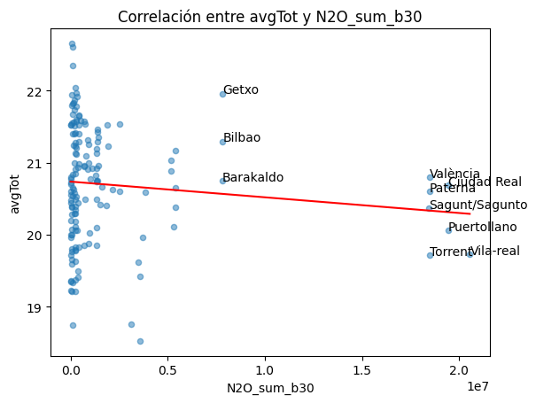
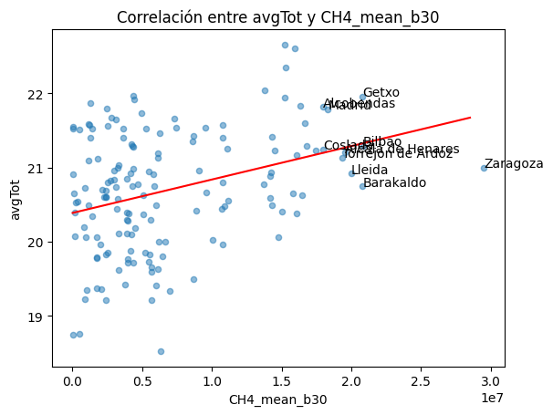

# Analisis emisiones contaminante en la longevidad
*Grupo de trabajo Longevidad **Col·legi d´Actuaris de Catalunya***

*Rep. GIT: https://github.com/anderestebanez/Analisis_longevidad*

## **Objetivo**:
El objetivo es analizar si existe correlación entre las tasas de fallecimiento y la longevidad con las emisiones contaminantes producidas en los diferentes complejos contaminantes de España.

## **Metodología**:
Como **variable Target**, en una primera versión, se usará la **esperanza de vida a los 65 años** en los municipios de España con más de 50k habitantes.

Para generar las **variables predictoras** partiremos, en una primera versión, únicamente del *Registro Estatal de Emisiones y Fuentes contaminantes*(https://prtr-es.es). En el PRTR está el inventario de las instalaciones contaminantes y las emisines y residuos generado desde 2001.

Se aplica la siguiente **transformación a los datos de PRTR**:
1. Se importan las emisiones historicas de cada complejo, datos desde 2001.
2. Se analizan únicamente las emisiones a la atmósfera. Y se agrupan los elementos contaminantes:
    * Metano (CH4): CH4
    * Amoniaco (NH3): NH3
    * Óxidos de nitrógeno (NOx/NO2): NO2
    * Óxido nitroso (N2O): N2O
    * Partículas (PM10): PM10
    * Monóxido de carbono (CO): CO
    * Partículas totales en suspensión (PST): PST
    * Dióxido de carbono (CO2): CO2
    * Óxidos de azufre (SOx/SO2): SO2
    * Compuestos orgánicos volátiles distintos del metano (COVNM): COVNM
    * Carbono orgánico total (COT) (aire): COT
    * Otros
3. Agregamos las emisiones históricas:
    * *SUM*: suma del total de emisiones realizadas desde 2001
    * *MEDIA*: las emisiones medias de los años en los que generó emisiones.
    * *MAX*: Emisiones máximas hechas en un año

Como resultado podemos dibujar alrededor de cada complejo un circulo donde consideraremos que impactarán sus emisiones. Por ejemplo, en caso de CO2 con un radio de 20km:
* Mayor concentración de complejos con altas emisiones de CO2 en las zonas de Barcelona, Madrid y norte de la peninsula. 
* Se observa en algunos puntos que la exposición al CO2 no se da por un solo complejo sino por la combinanción de 2 o más en un radio inferior a 20km.

  

**Método de cruce** entre los datos de emisiones y los municipios:
    1. Extraemos las áreas de los municipios españoles con más de 50k habitantes.
    2. Identificamos para cada uno de los municipios los complejos que tiene a un radio de 10, 20 y 30km y sumamos las emisiones de todos los complejos. 

En el siguiente gráfico se puede ver todos los complejos disponibles en PRTR (puntos azules) y los radios de 10, 20 y 30km alrededor de los municipios de más de 50k habitantes (lineas verdes).

## **Resultados**

Como primeras conclusiones que sacamos son:
* Se observa para cada todos las variables explicativas que hay municipios con valores muy altos que dificultan visualmente sacar conclusiones.
* Hay más correlaciones positivas que negativas, esto es, que ha mayor emisiones mayor esperanza de vida. Esto contradice muchos estudios y hace suponer que se trata de una correlación casual.

Más en detalle, podemos ver que los factores que más correlacionan con cada año y sexo son:

Si simplificamos el análisis buscando la correlación para ambos sexos y con la esperanza de vida media entre los años 2014 a 2021, vemos que los 10 factores con más correlación positiva y negativa son:

Y si mostramos el factor con correlación más alta y más baja vemos que los municipios se concentran en rangos y que la correlación tiene pinta de ser casual.

## **Próximos pasos**

* Agregar las emisiones anuales una vez que tenemos las instalaciones cruzadas con los municipios.
* Usar como variable target las qx por tramos de edad, y ver si las curvas varían según el nivel de emisiones a su alrededor.
* Generar una métrica para medir la capacidad de la variables explicativa de cambiar la curva de Qx.
* Generar nuevas variables explicativas relacionadas con el clima y medio ambiente. Por ejemplo las variables agroclimáticas: https://www.mapa.gob.es/es/agricultura/temas/sistema-de-informacion-geografica-de-datos-agrarios/informacion_agroclimatica.aspx
